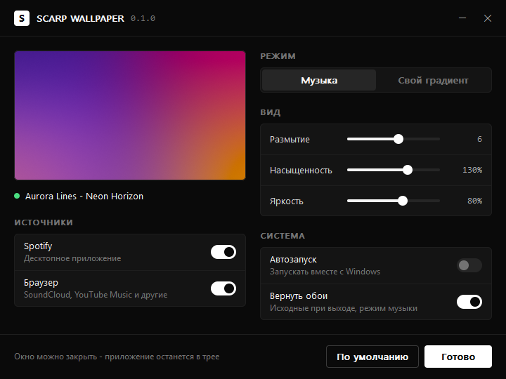
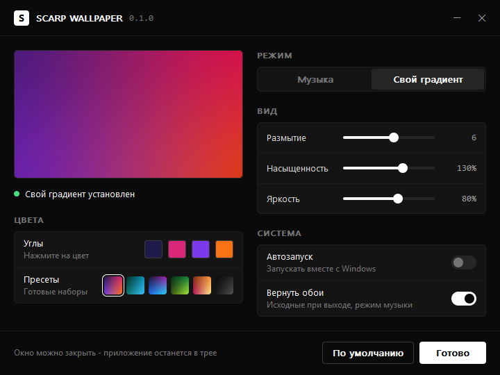

<div align="center">


# SCARP WALLPAPER

Градиентные обои рабочего стола из обложки трека, который сейчас играет в Spotify или в браузере.

[](https://github.com/scarrymany/scarp-wallpaper/releases/latest)
[](https://github.com/scarrymany/scarp-wallpaper/actions/workflows/build.yml)
[](https://github.com/scarrymany/scarp-wallpaper/releases)


[](LICENSE)

[Скачать](https://github.com/scarrymany/scarp-wallpaper/releases/latest) · [Изменения](CHANGELOG.md) · [Сообщить об ошибке](https://github.com/scarrymany/scarp-wallpaper/issues/new/choose) · [scarp.cc](https://scarp.cc)



</div>

Градиентные обои рабочего стола из обложки трека, который сейчас играет в Spotify или в браузере (SoundCloud, YouTube Music и другие). Или свой градиент, собранный вручную, который остаётся на рабочем столе навсегда.

Нативное приложение для Windows на Rust: один `.exe` на 300 КБ, без рантаймов и фреймворков, интерфейс в стиле [scarp.cc](https://scarp.cc).

## Новое в 0.2.0

- **Анимации в окне настроек** на пружинной физике: переключатели, плашка режима, кнопки, ползунки, пресеты, смена превью и статуса. Анимацию можно прервать на середине, движение продолжится плавно, без рывка.
- Таймер кадров работает только пока что-то движется. В покое окно, как и раньше, не тратит CPU.
- Учитывается системная настройка «Анимация элементов управления и элементов внутри окна»: если она выключена, всё переключается мгновенно.
- Сборка и релизы через GitHub Actions: к каждому релизу прикладывается `.exe` и его SHA256.

Полный список изменений в [CHANGELOG.md](CHANGELOG.md).

## Возможности

- **Режим «Музыка»**: обложка текущего трека размывается в мягкий градиент и сразу ставится на обои. Смена трека означает новые обои.
- **Режим «Свой градиент»**: четыре цвета по углам (системная палитра) или готовые пресеты. Градиент сохраняется и остаётся после перезагрузки Windows, даже если приложение закрыто.
- Настройки вида: размытие, насыщенность, яркость, с живым превью.
- Источники: Spotify (десктоп) и браузеры: Chrome, Edge, Firefox, Opera, Brave, Vivaldi, Яндекс, Arc.
- Автозапуск вместе с Windows (тихо, в трей).
- В режиме музыки исходные обои возвращаются при выходе (отключается).
- Поддержка нескольких мониторов и HiDPI.

<p align="center">
  
  
</p>

## Нагрузка на систему

Приложение почти всё время спит. Оно не опрашивает плееры, а подписано на системные события Windows.

| Состояние | Память (private) | CPU |
| --- | --- | --- |
| В трее, ожидание | ~5 МБ | 0% |
| Смена трека | +0 МБ (строки пишутся потоком) | ~0.1 с один раз, фоновый приоритет |
| Открыто окно настроек | +1-2 МБ, освобождается при закрытии | 0% в простое |

Как это достигается:

- **GSMTC** (Global System Media Transport Controls): один системный API отдаёт и Spotify, и вкладки браузера вместе с обложкой. Работает только на событиях, без таймеров.
- Обложка декодируется встроенным WinRT-декодером сразу в 64x64, без сторонних библиотек.
- Размытие считается на сетке 64 px в линейном свете. Затем идёт апскейл кубическим B-сплайном до разрешения экрана с дизерингом против бандинга. Готовые строки сразу пишутся в файл, полный кадр в памяти не хранится.
- Рендер идёт в потоке с `THREAD_MODE_BACKGROUND_BEGIN`: пониженный приоритет CPU, диска и памяти, поэтому игры и другие приложения не проседают.
- Одинаковые обложки (треки одного альбома) не перерисовываются.
- Окно настроек отрисовано вручную в один буфер, без дочерних контролов. Всё, что оно занимало, освобождается при закрытии.
- Анимации считаются аналитическим решением уравнения пружины, поэтому не зависят от частоты кадров. Таймер кадров запускается на время движения и сразу останавливается.

## Установка

1. Скачайте `scarp-wallpaper.exe` со страницы [Releases](https://github.com/scarrymany/scarp-wallpaper/releases/latest). Рядом лежит `scarp-wallpaper.exe.sha256` для проверки: `(Get-FileHash scarp-wallpaper.exe).Hash` в PowerShell должен совпасть с ним.
2. Запустите. Откроется окно настроек, а иконка появится в трее.
3. Включите музыку или выберите «Свой градиент».

Повторный запуск exe открывает настройки уже работающей копии. Выход: правый клик по иконке в трее и пункт «Выход».

Требования: Windows 10 1903+ или Windows 11, x64.

## Где хранятся данные

| Что | Путь |
| --- | --- |
| Настройки | `%APPDATA%\ScarpWallpaper\settings.ini` |
| Файлы обоев | `%LOCALAPPDATA%\ScarpWallpaper\wallpaper-a.bmp`, `wallpaper-b.bmp` |
| Автозапуск | `HKCU\Software\Microsoft\Windows\CurrentVersion\Run\ScarpWallpaper` |

## Ограничения

- Windows не сообщает, какой сайт играет во вкладке, поэтому источник «Браузер» реагирует на любую музыку или видео с обложкой (YouTube тоже). Если это мешает, отключите его в настройках.
- Если плеер не передаёт обложку, обои не меняются.

## Сборка

```bash
cargo build --release
```

Нужны Rust 1.88+ (edition 2024) и Windows SDK (для `rc.exe`, через `embed-resource`).

Те же проверки, что и в CI:

```bash
cargo fmt --check
cargo clippy --all-targets -- -D warnings
cargo test
```

Релиз собирается автоматически при пуше тега `vX.Y.Z` (workflow `release.yml`): версия тега должна совпадать с `Cargo.toml`, а описание релиза берётся из раздела `CHANGELOG.md`. Можно и без тега: Actions → Release → Run workflow выпустит версию из `Cargo.toml` и сам создаст тег.

## Лицензия

[MIT](LICENSE)
