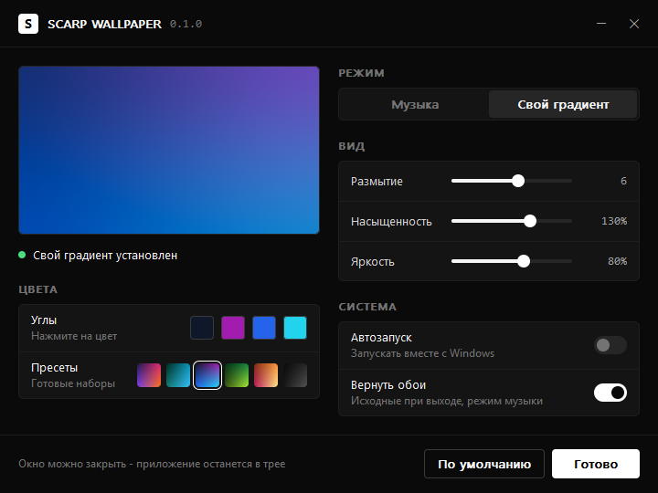

# SCARP WALLPAPER

Градиентные обои рабочего стола из обложки трека, который сейчас играет в Spotify или в браузере (SoundCloud, YouTube Music и другие). Или свой градиент, собранный вручную, который остаётся на рабочем столе навсегда.

Нативное приложение для Windows на Rust: один `.exe` на 300 КБ, без рантаймов и фреймворков, интерфейс в стиле [scarp.cc](https://scarp.cc).


## Возможности

- **Режим «Музыка»**: обложка текущего трека размывается в мягкий градиент и сразу ставится на обои. Смена трека означает новые обои.
- **Режим «Свой градиент»**: четыре цвета по углам (системная палитра) или готовые пресеты. Градиент сохраняется и остаётся после перезагрузки Windows, даже если приложение закрыто.
- Настройки вида: размытие, насыщенность, яркость, с живым превью.
- Источники: Spotify (десктоп) и браузеры: Chrome, Edge, Firefox, Opera, Brave, Vivaldi, Яндекс, Arc.
- Автозапуск вместе с Windows (тихо, в трей).
- В режиме музыки исходные обои возвращаются при выходе (отключается).
- Поддержка нескольких мониторов и HiDPI.




## Нагрузка на систему

Приложение почти всё время спит. Оно не опрашивает плееры, а подписано на системные события Windows.

| Состояние | Память (private) | CPU |
| --- | --- | --- |
| В трее, ожидание | ~5 МБ | 0% |
| Смена трека | +0 МБ (строки пишутся потоком) | ~0.1 с один раз, фоновый приоритет |
| Открыто окно настроек | +1-2 МБ, освобождается при закрытии | 0% в простое |

Как это достигается:

- **GSMTC** (Global System Media Transport Controls): один системный API отдаёт и Spotify, и вкладки браузера вместе с обложкой. Работает только на событиях, без таймеров.
- Обложка декодируется встроенным WinRT-декодером сразу в 64x64, без сторонних библиотек.
- Размытие считается на сетке 64 px в линейном свете. Затем идёт апскейл кубическим B-сплайном до разрешения экрана с дизерингом против бандинга. Готовые строки сразу пишутся в файл, полный кадр в памяти не хранится.
- Рендер идёт в потоке с `THREAD_MODE_BACKGROUND_BEGIN`: пониженный приоритет CPU, диска и памяти, поэтому игры и другие приложения не проседают.
- Одинаковые обложки (треки одного альбома) не перерисовываются.
- Окно настроек отрисовано вручную в один буфер, без дочерних контролов. Всё, что оно занимало, освобождается при закрытии.

## Установка

1. Скачайте `scarp-wallpaper.exe` со страницы [Releases](https://github.com/scarrymany/scarp-wallpaper/releases).
2. Запустите. Откроется окно настроек, а иконка появится в трее.
3. Включите музыку или выберите «Свой градиент».

Повторный запуск exe открывает настройки уже работающей копии. Выход: правый клик по иконке в трее и пункт «Выход».

Требования: Windows 10 1903+ или Windows 11, x64.

## Где хранятся данные

| Что | Путь |
| --- | --- |
| Настройки | `%APPDATA%\ScarpWallpaper\settings.ini` |
| Файлы обоев | `%LOCALAPPDATA%\ScarpWallpaper\wallpaper-a.bmp`, `wallpaper-b.bmp` |
| Автозапуск | `HKCU\Software\Microsoft\Windows\CurrentVersion\Run\ScarpWallpaper` |

## Ограничения

- Windows не сообщает, какой сайт играет во вкладке, поэтому источник «Браузер» реагирует на любую музыку или видео с обложкой (YouTube тоже). Если это мешает, отключите его в настройках.
- Если плеер не передаёт обложку, обои не меняются.

## Сборка

```bash
cargo build --release
```

Нужны Rust 1.88+ (edition 2024) и Windows SDK (для `rc.exe`, через `embed-resource`). Тесты: `cargo test`.

## Лицензия

[MIT](LICENSE)
